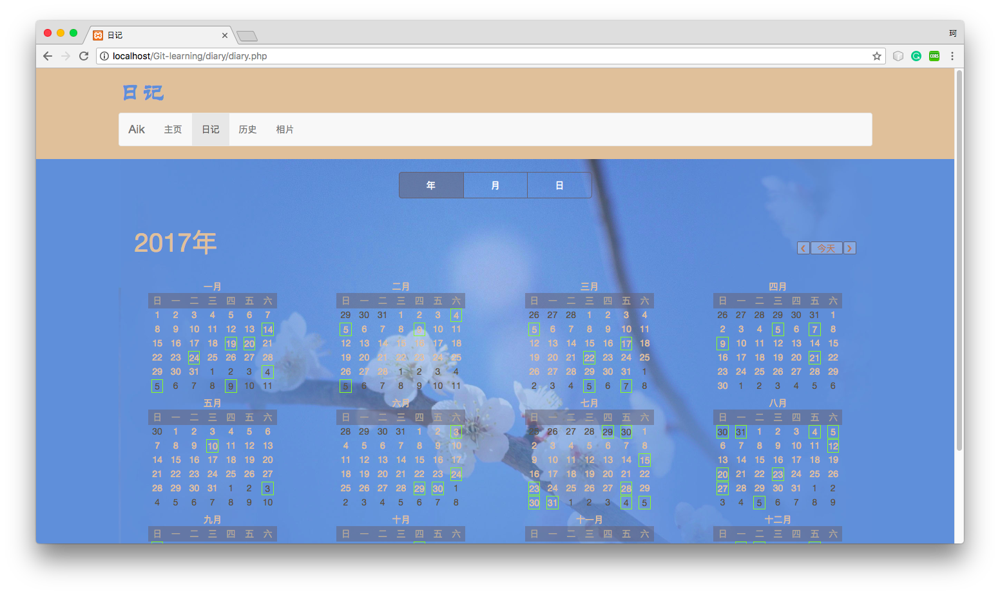
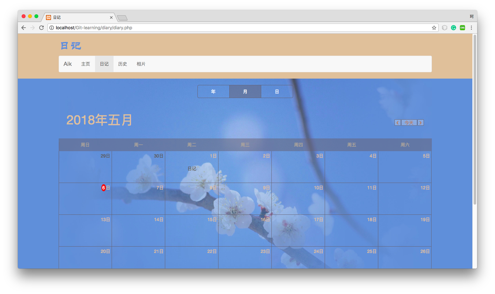
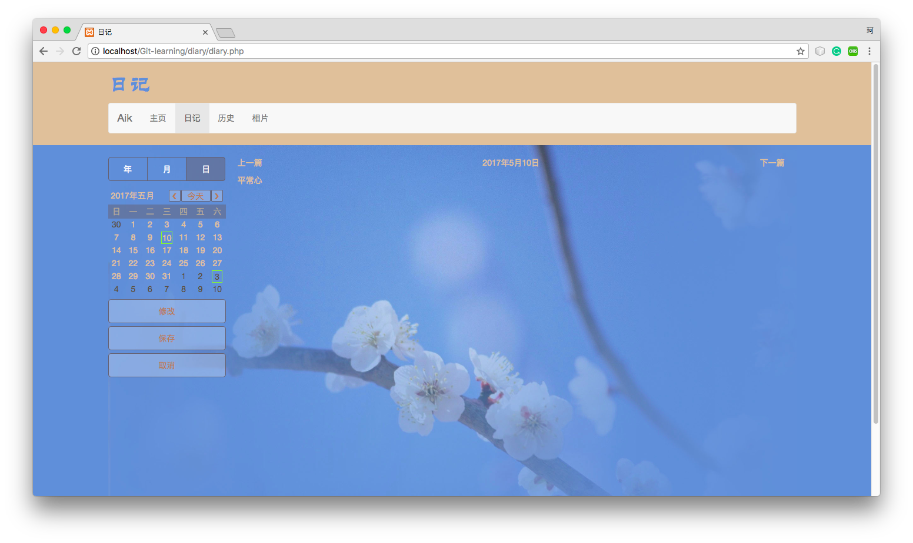

# Git-learning
This project is used to practice git.

----
## Some screenshots
1.Screenshot of the calendar in "year" mode

2.Screenshot of the calendar in "month" mode

3.Screenshot of the calendar in "day" mode

